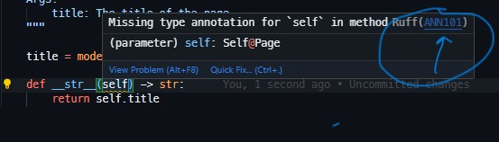

# Djange Template Harness

A minimal Django project for testing Jinja templates.

Dev dependencies have been tested in Codespaces -- just open one to get started!

Developers desiring alternate environments may reverse engineer dependencies from `.devcontainer/devcontainer.json`.

## Render the templates with the Django web server

Run the server and open the development URL:

```shell
$ django-admin runserver

Watching for file changes with StatReloader
Performing system checks...

System check identified no issues (0 silenced).
November 16, 2023 - 03:48:05
Django version 4.2.7, using settings 'dj_template_harness.settings'
Starting development server at http://127.0.0.1:8000/
Quit the server with CONTROL-C.
```

ActionKit provides [example templates](https://dsa.actionkit.com/docs/manual/developer/templates.html) in their documentation. The reference for `recurring_update.html` is currently saved as `recurring_update.html.example`.

## Running tests

Use the built-in django-admin command to run tests using the Django context:

```shell
$ django-admin test
```

## Pre-commit hooks

Pre-commit hooks are configured to run code checks before completing your commits. 

### Linting and Formatting

[Ruff](https://docs.astral.sh/ruff/) is a modern, all-in-one formatter + linter. See their [configuration docs](https://docs.astral.sh/ruff/configuration/) to further configure `pyproject.toml` if you need to. 

> To assist developers less familiar with idiomatic Python, the [linting setting](https://github.com/dsa-ntc/dj-template-harness/blob/bc25319b4bc05db5df9dce61e57a5e7ff58f7f1f/pyproject.toml#L22) has been set to `"ALL"` so that all linting rules configurable by Rust are ran pre-comit. Additional exceptions to `"ALL"` should be reasonably justified before adding to `pyproject.toml`. Check the Ruff documentation for the specific reasoning behind a violated rule:
> 
> )

### Package management

This project uses the `pyproject.toml` as the modern standard for metadata and dependency declaration. Additional third-party packages should be declared there instead of `requirements.txt`, and packages should be manually installed when necessary via `pip install .`. `requirements.txt` is automatically generated by `pip-tools` in a pre-commit hook.


